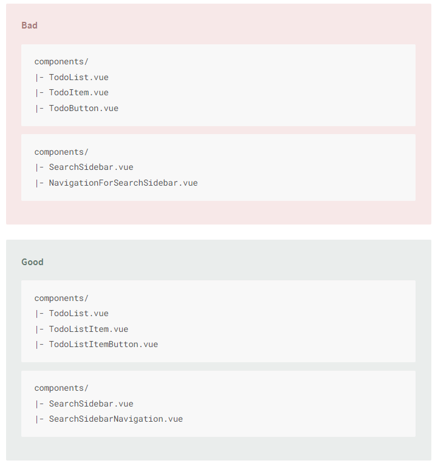
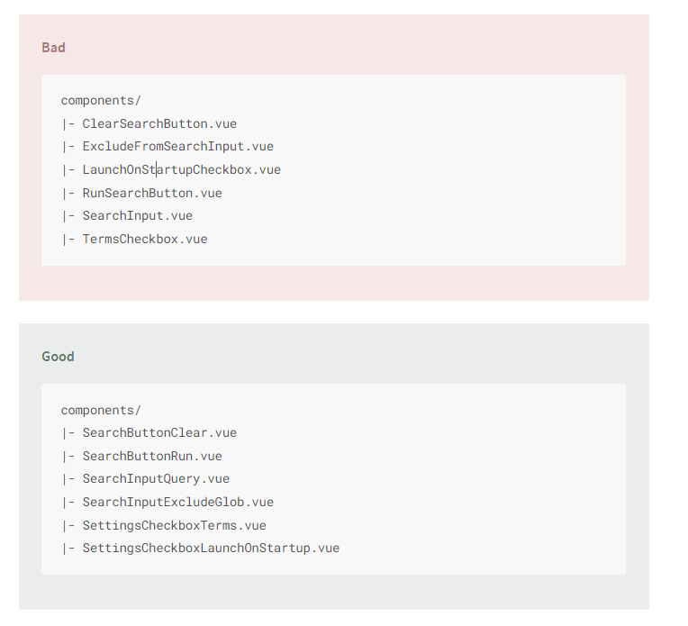

# Single File component filename

- Filenames of single-file components should either be always PascalCase or always
  kebab-case. ([more](#filenames-example))
- Base components (a.k.a. presentational, dumb, or pure components) that apply app-specific styling and conventions
  should all begin with a specific prefix, such as Base, App, or V. ([more](#base-component-example))
- Components that should only ever have a single active instance should begin with the ```The``` prefix, to denote that
  there can be only one. ([more](#single-component-example))
- Child components that are tightly coupled with their parent should include the parent component name as a
  prefix. ([more](#child-component-example))
- Component names should start with the highest-level (often most general) words and end with descriptive modifying
  words. ([more](#highest-level-component-example))

### Filenames example

- * components
    * MyComponent.vue
    * ~~myComponent.vue~~
    * ~~mycomponent.vue~~
    * ~~my-component.vue~~

  - In components
    ```vue
    <script>
      export default {
        name: 'MyComponent' // good
        name: 'myComponent' // bad
        name: 'my-component' // bad
      }
    </script>
  - In template
    ```vue
    <template>
        <MyComponent /> // bad
        <my-component /> // bad
        <myComponent /> // bad
    </template>


### Base component example

These components lay the foundation for consistent styling and behavior in your application. They may only contain:

HTML elements, other base components, and 3rd-party UI components. But they’ll never contain global state (e.g. from a
Vuex store).

Their names often include the name of an element they wrap (e.g. BaseButton, BaseTable), unless no element exists for
their specific purpose (e.g. BaseIcon). If you build similar components for a more specific context, they will almost
always consume these components (e.g. BaseButton may be used in ButtonSubmit).

Some advantages of this convention:

When organized alphabetically in editors, your app’s base components are all listed together, making them easier to
identify.

Since component names should always be multi-word, this convention prevents you from having to choose an arbitrary
prefix for simple component wrappers (e.g. MyButton, VueButton).

Since these components are so frequently used, you may want to simply make them global instead of importing them
everywhere. A prefix makes this possible with Webpack:

```js
var requireComponent = require.context("./src", true, /Base[A-Z]\w+\.(vue|js)$/)
requireComponent.keys().forEach(function (fileName) {
  var baseComponentConfig = requireComponent(fileName)
  baseComponentConfig = baseComponentConfig.default || baseComponentConfig
  var baseComponentName = baseComponentConfig.name || (
    fileName
      .replace(/^.+\//, '')
      .replace(/\.\w+$/, '')
  )
  Vue.component(baseComponentName, baseComponentConfig)
})
```

### Single component example

* components
    * TheHeading.vue
    * TheFooter.vue
    * ~~Heading.vue~~
    * ~~MySidebar.vue~~

### Child component example

You might be tempted to solve this problem by nesting child components in directories named after their parent. For
example:

* components
    * TodoList
        * Item
            * index.vue
            * Button.vue
        * index.vue

or:

* components
  * TodoList
    * Item
      * Button.vue
    * Item.vue 
    * TodoList.vue

This isn’t recommended, as it results in:

- Many files with similar names, making rapid file switching in code editors more difficult. Many nested sub-directories,
- which increases the time it takes to browse components in an editor’s sidebar.




### Highest level component example

You may be wondering:

> Why would we force component names to use less natural language?

In natural English, adjectives and other descriptors do typically appear before the nouns, while exceptions require connector words. For example:

Coffee with milk
Soup of the day
Visitor to the museum
You can definitely include these connector words in component names if you’d like, but the order is still important.

Also note that what’s considered “highest-level” will be contextual to your app. For example, imagine an app with a search form. It may include components like this one:

* components
  * ClearSearchButton.vue
  * ExcludeFromSearchInput.vue
  * LaunchOnStartupCheckbox.vue
  * RunSearchButton.vue
  * SearchInput.vue
  * TermsCheckbox.vue


As you might notice, it’s quite difficult to see which components are specific to the search. Now let’s rename the components according to the rule:

* components
  * SearchButtonClear.vue
  * SearchButtonRun.vue
  * SearchInputExcludeGlob.vue
  * SearchInputQuery.vue
  * SettingsCheckboxLaunchOnStartup.vue
  * SettingsCheckboxTerms.vue


Since editors typically organize files alphabetically, all the important relationships between components are now evident at a glance.

You might be tempted to solve this problem differently, nesting all the search components under a “search” directory, then all the settings components under a “settings” directory. We only recommend considering this approach in very large apps (e.g. 100+ components), for these reasons:

It generally takes more time to navigate through nested sub-directories, than scrolling through a single components' directory.
Name conflicts (e.g. multiple ButtonDelete.vue components) make it more difficult to quickly navigate to a specific component in a code editor.
Refactoring becomes more difficult, because find-and-replace often isn’t sufficient to update relative references to a moved component.




[Vue official style guide](https://vuejs.org/v2/style-guide/#Multi-word-component-names-essential)
