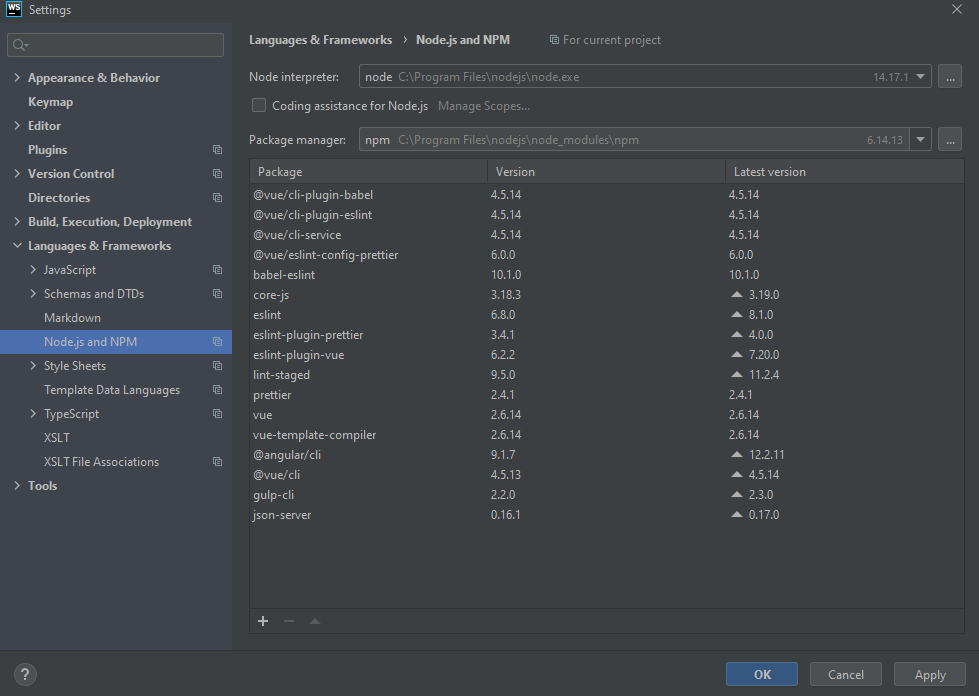
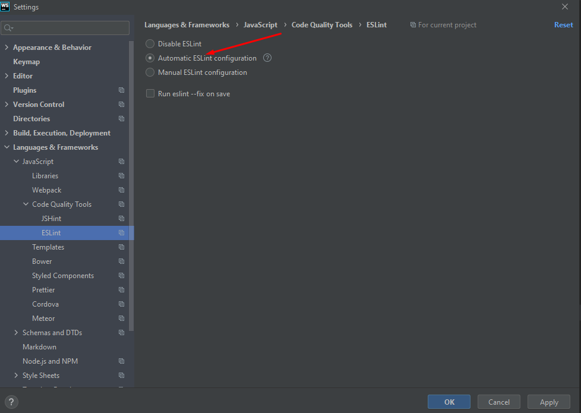
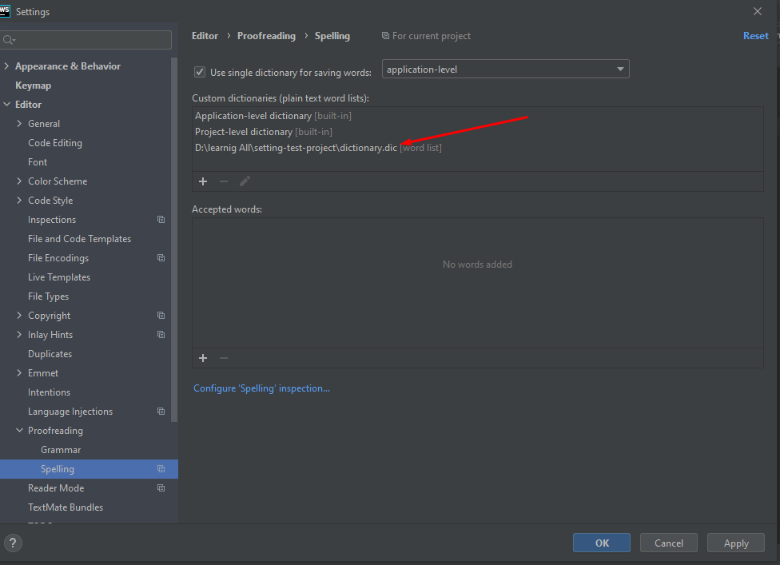
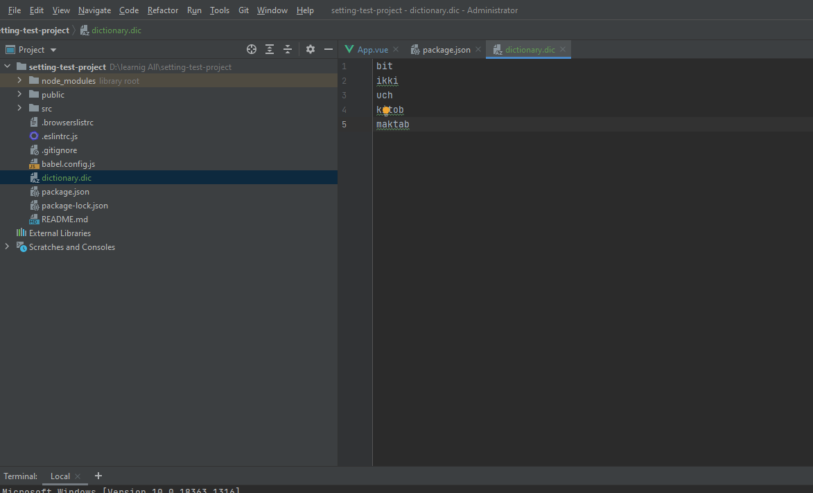

#ESLint

##Before you start


1. Make sure you have Node.js on your computer.
2. Make sure a local Node.js interpreter is configured in your project:
open the Settings/Preferences dialog Ctrl+Alt+S and go to Languages 
and Frameworks | Node.js and NPM. The Node Interpreter field shows 
the default project Node.js interpreter.
   


##Install ESLint


1. In the embedded Terminal (Alt+F12), type one of the following commands:
```
   - npm install --g eslint for global installation.

   - npm install --save-dev eslint to install ESLint as a development dependency.
```

##Configure ESLint automatically


To configure ESLint automatically in the current project, 
open the Settings/Preferences dialog Ctrl+Alt+S, go to Languages
and Frameworks | JavaScript | Code Quality Tools | ESLint, 
and select the Automatic ESLint configuration option.


##Fix problems automatically on save
ESLint can fix the detected problems every time your changes 
are saved either manually, with Ctrl+S, or automatically, 
when you launch a run/debug configuration, or close WebStorm, 
or perform version control actions, see Autosave for details.

Open the Settings/Preferences dialog Ctrl+Alt+S, go to Languages 
and Frameworks | JavaScript | Code Quality Tools | ESLint,
and select the Run eslint --fix on save checkbox.


##Dictionaries


If you have the Hunspell plugin installed and enabled,
you can add Hunspell dictionaries, which comprise of two files:
the DIC file that contains a list of words with the applicable
modification rules and the AFF file that lists prefixes 
and suffixes regulated by a specific modification rule. 
For example, en_GB.dic and en_GB.aff.


###Configure the spellchecker dictionaries

Press Ctrl+Alt+S to open the IDE settings and select Editor | Natural Languages | Spelling.
Configure the list of custom dictionaries:

To add a new custom dictionary to the list, click the Add button or 
press Alt+Insert and specify the location of the required file.

To edit the contents of a custom dictionary in WebStorm, select it 
and click the Edit button or press Enter. The corresponding file will 
open in a new editor tab.

To remove a custom dictionary from the list, select it and click 
the Remove button or press Alt+Delete.




An unfamiliar words must be written in a line.


[you can see more information](https://www.jetbrains.com/help/webstorm/eslint.html)
